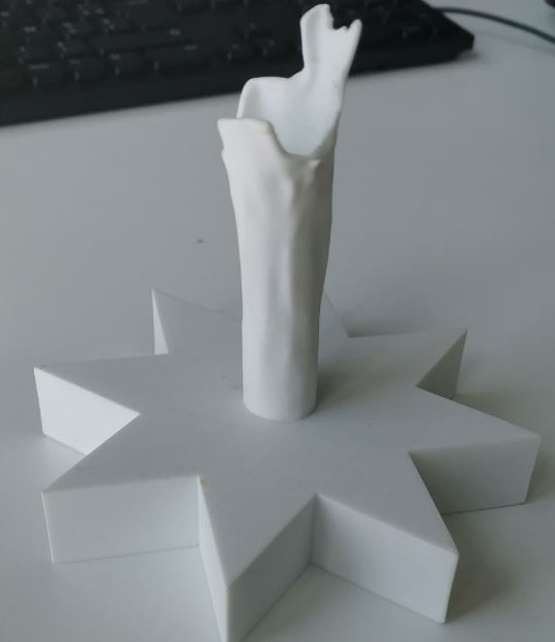

# DEPRECATED - This repo is no longer maintained

-----

# SolARModulePCL

The **SolAR Module PCL** is a module to use [ Point Cloud Library](https://pointclouds.org/). The Point Cloud Library (PCL) is a standalone, large scale, open project for 2D/3D image and point cloud processing. PCL is released under the terms of the **BSD license**, and thus free for commercial and research use.

The PCL framework contains numerous state-of-the art algorithms including filtering, feature estimation, surface reconstruction, registration, model fitting and segmentation. These algorithms can be used, for example, to filter outliers from noisy data, stitch 3D point clouds together, segment relevant parts of a scene, extract keypoints and compute descriptors to recognize objects in the world based on their geometric appearance, and create surfaces from point clouds and visualize them. It requires [Flann](https://github.com/mariusmuja/flann) (Fast Library for Approximate Nearest Neighbors).

## Tests

### SolARTestPCLPointCloudLoader
To test loading of 3D mesh (.pcd/.ply) 

|  |    |
|:-:|:-:|
| Ground truth | frac_star.pcd |
