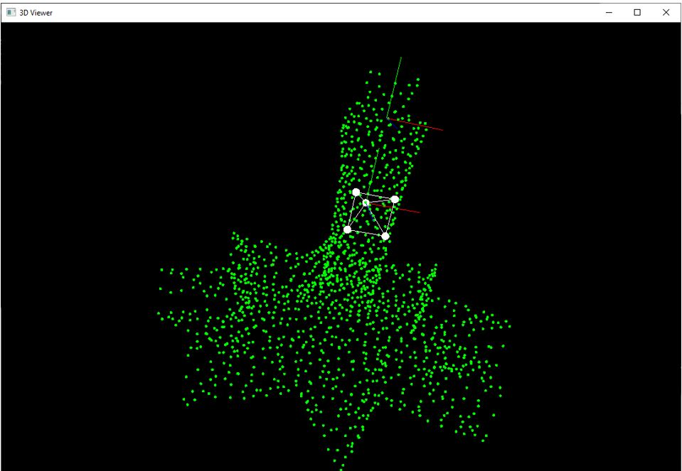

SolARModulePCL
=============

*SolAR is an open-source framework released under Apache license 2.0 making possible to easily create your own camera pose estimation solution to develop Augmented Reality applications. 
SolAR is dedicated to Augmented Reality (AR).
It offers a C++ SDK to easily and quickly develop and use custom solutions for camera pose estimation. It provides developers with a full chain from low-level vision components development to camera pose estimation pipelines and AR service development.*

The **SolAR Module PCL** is a module to use [ Point Cloud Library](https://pointclouds.org/). The Point Cloud Library (PCL) is a standalone, large scale, open project for 2D/3D image and point cloud processing. PCL is released under the terms of the **BSD license**, and thus free for commercial and research use.

## Tests

### SolARTestPCLPointCloudLoader
To test loading of 3D mesh (.pcd/.ply) 

|  |    |
|:-:|:-:|
| Ground truth | frac_star.pcd |